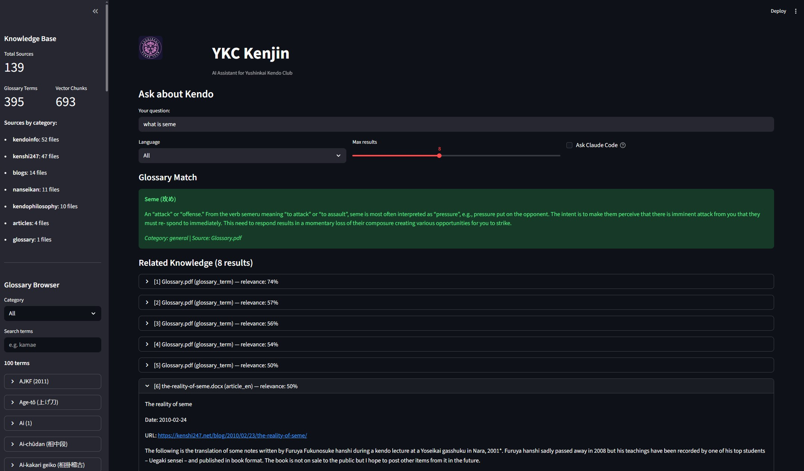

# YSK Kenjin

AI assistant for **Yushinkai Kendo Team** — a kendo knowledge retrieval system powered by RAG (Retrieval-Augmented Generation).

YSK Kenjin (Yushinkai Kenjin) helps kendo practitioners find accurate answers grounded in curated sources: glossary terms, translated articles, and blog content from the kendo community. Every answer comes with citations — no hallucinations.



## What It Does

- **Glossary lookup**: 395 kendo terms parsed from a PDF glossary
- **Semantic search**: Ask natural-language questions, get relevant passages from curated kendo sources
- **Blog scraping**: Built-in scrapers for 5 kendo blog sources (WordPress + Blogspot)
- **Prompt builder**: Generates ready-to-paste prompts for Claude with full context and source citations
- **Dual interface**: Streamlit web UI + FastAPI REST API + CLI

## Quick Start

```bash
# 1. Clone and create venv
python -m venv .venv

# 2. Activate venv
# Windows (cmd):
.venv\Scripts\activate
# Windows (PowerShell):
.venv\Scripts\Activate.ps1
# macOS / Linux:
source .venv/bin/activate

# 3. Install
pip install -e ".[dev]"

# 4. Configure environment
copy .env.example .env        # Windows
# cp .env.example .env        # macOS / Linux
# Edit .env — set KENDO_THEORY_DIR to your source documents folder

# 5. Add source documents to your KENDO_THEORY_DIR (see docs/adding-content.md)

# 6. Ingest and verify
python scripts/ingest_all.py --reset
python scripts/verify_pipeline.py

# 7. Launch UI
set PYTHONPATH=src            # Windows
# export PYTHONPATH=src       # macOS / Linux
python -m streamlit run src/kendocenter/ui/app.py
```

## How It Works

```
You ask a kendo question
        |
        v
  ┌─────────────┐     ┌──────────────────┐     ┌──────────────┐
  │ SQLite       │     │ ChromaDB         │     │ SQLite FTS5  │
  │ Exact term   │     │ Vector search    │     │ BM25 keyword │
  │ lookup       │     │ (cosine sim)     │     │ search       │
  │ (395 terms)  │     │  690+ chunks     │     │              │
  └──────┬───────┘     └────────┬─────────┘     └──────┬───────┘
         │                      │                       │
         │                      └───────┬───────────────┘
         │                              │
         │                   Reciprocal Rank Fusion
         │                              │
         │                   Cross-encoder re-ranking
         │                              │
         └──────────┬───────────────────┘
                    │
             Merge + resolve source metadata
                    │
                    v
         Formatted prompt with citations
                    │
              ┌─────┴─────┐
              │ Copy-paste │  or  Claude Code auto-call
              │ to Claude  │
              └────────────┘
```

**Dual-store design**: SQLite handles exact term lookups ("What is zanshin?"). ChromaDB handles semantic search ("How should I prepare for shiai?"). The retriever runs both and merges results.

**Source registry**: Each document is registered with a short key (G1, A1, A2...). Chunks store only the key; full metadata is resolved at query time. See [Architecture](docs/architecture.md) for details.

## Content Sources

YSK Kenjin supports multiple source categories. You provide your own content — the repo contains only the code, not the data.

| Category | Description |
|----------|-------------|
| **glossary** | PDF glossary of kendo terms (LaTeX two-column format) |
| **articles** | Translated kendo articles (.docx with EN/VN sections) |
| **blogs** | Scraped blog articles from WordPress/Blogspot sites |

Built-in blog scrapers for 5 sources:
- **kendo3ka** — Vietnamese kendo theory articles
- **kenshi247** — English kendo theory (kenshi247.net)
- **kendoinfo** — English articles (Geoff Salmon's blog)
- **nanseikan** — English articles (Nanseikan kendo blog)
- **kendophilosophy** — Kendo history and philosophy

New blog sources can be added by creating a `urls.yaml` + scraper config. See [Adding Content](docs/adding-content.md).

## Documentation

| Doc | Description |
|-----|-------------|
| [Architecture](docs/architecture.md) | Ingestion & retrieval pipelines, dual-store design, source registry, project structure |
| [Adding Content](docs/adding-content.md) | How to add new articles, blog scrapers, metadata.yaml format |
| [API Reference](docs/api-reference.md) | REST endpoints, scripts, configuration, .env settings |
| [Demo Questions](docs/demo-questions.md) | Sample queries for testing and demos |
| [Project Plan](PLAN.md) | Roadmap, design decisions, phase history |

## Scripts

| Script | Description |
|--------|-------------|
| `scripts/ingest_all.py` | Run ingestion. `--reset` to rebuild from scratch. |
| `scripts/query_cli.py` | Test queries. `--interactive` for REPL, `--prompt` for full prompt. |
| `scripts/verify_pipeline.py` | Verify database + vector store + retrieval (7 checks). |
| `scripts/verify_api.py` | Start server, run 9 API checks, stop server. |
| `scripts/run_eval.py` | RAG evaluation: recall@k, MRR, keyword recall. `--verbose` for detail. |
| `scripts/compare_models.py` | Compare two eval result JSON files side-by-side. |
| `scripts/scraping/scrape_*.py` | Per-site blog scrapers. `--dry-run` to preview. |
| `scripts/stop_servers.py` | Kill running uvicorn/streamlit processes. |

## Tech Stack

Python 3.12 / FastAPI / Streamlit / ChromaDB / SQLite / sentence-transformers / pdfplumber / python-docx / PyYAML

## Roadmap

- **Phase 1** (COMPLETE): Knowledge base + RAG pipeline + Streamlit UI + FastAPI + Claude Code CLI
- **Phase 1.5** (COMPLETE): Source restructuring, metadata.yaml, source registry, blog scrapers (5 sources)
- **Phase 2A** (COMPLETE): Evaluation framework, cross-encoder re-ranking, embedding model upgrade support, chunking tuning
- **Phase 2B** (COMPLETE): Hybrid search (BM25+vector via RRF), fuzzy glossary matching, source quality weighting, embedding model upgrade support
- **Phase 2C**: Claude API integration, streaming UI, conversation memory
- **Phase 3**: Yushinkai team intelligence (Facebook data, team events) + YouTube video catalog (metadata search)
- **Phase 4**: Japanese kendo terminology engine (JP-EN mapping, pronunciation data, Whisper prep)
- **Phase 5**: Kendo video processing (transcription, kendo-aware translation, subtitles)
- **Phase 6**: Web frontend (Next.js), technique encyclopedia, multi-user, PostgreSQL

## License

This project is licensed under the [GNU Affero General Public License v3.0](LICENSE) (AGPL-3.0).

If you use or modify this software — including running it as a web service — you must make your source code available under the same license.

## Attribution

Blog content is scraped from publicly available kendo blogs for educational, non-commercial use. All scraped articles retain their original attribution (author, date, source URL) in the metadata. If you are a blog author and would like your content excluded, please open an issue.
